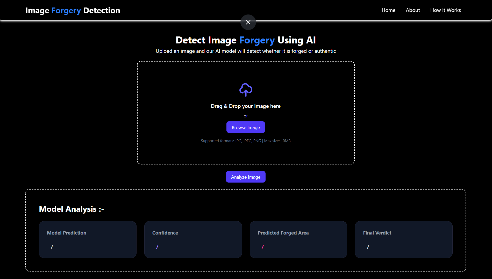
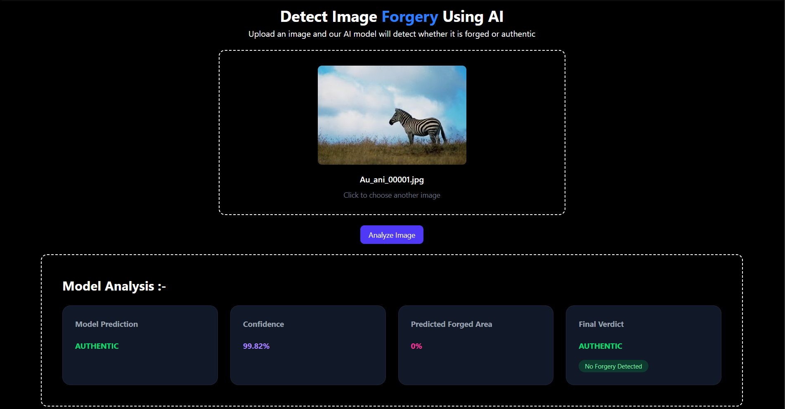
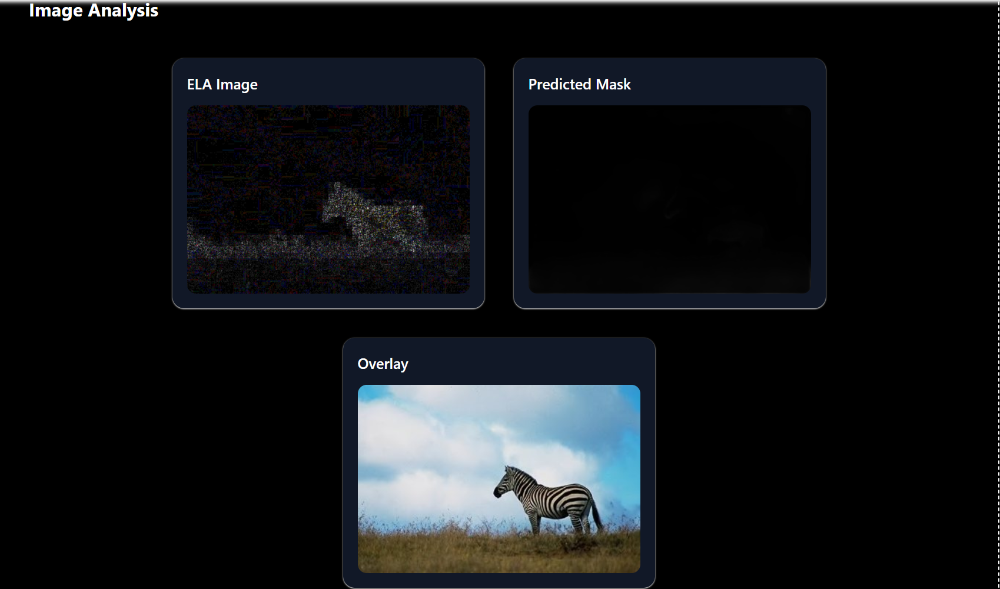
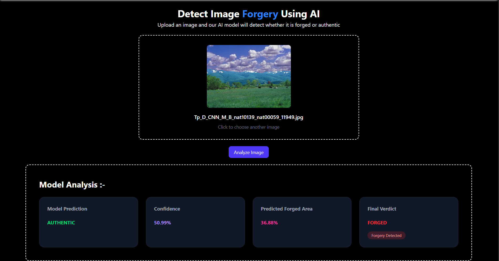
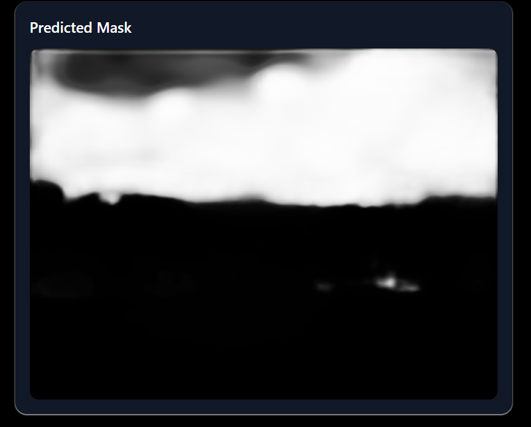
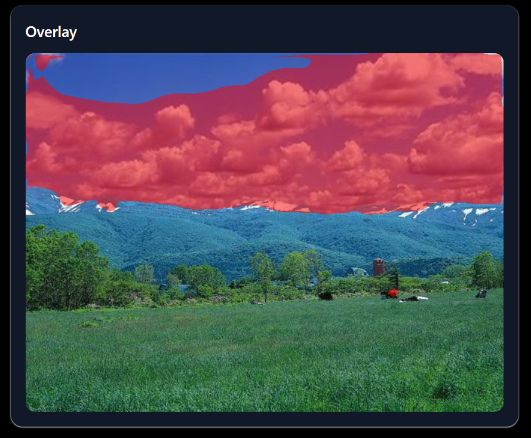

# Image Forgery Detection and Localization

An AI-powered image forgery detection system that analyzes uploaded images and determines whether an image is authentic or forged. The system also provides visualization of potentially manipulated regions.

## 🚀 Features

- Upload an image for analysis
- Detect whether an image is authentic or forged
- Error Level Analysis (ELA) preprocessing
- Deep learning-based forgery detection
- Forged-region localization
- Confidence score
- Visual analysis of the uploaded image
- REST API using Flask
- React/TypeScript frontend
- Dockerized frontend and backend
- Jenkins CI/CD pipeline
- Kubernetes deployment

## 🏗️ Architecture

```text
User
 │
 ▼
Frontend
 │
 │ HTTP Request
 ▼
Flask Backend
 │
 ├── ELA preprocessing
 │
 ├── Forgery Detection Model
 │
 └── Forgery Localization Model
 │
 ▼
Prediction + Visualization
 │
 ▼
Frontend
```

## 📸 Screenshots

### Home Page



### Authentic Image



### Authentic Image Result



### Tampered Image



### Tampered Image Results

<table>
  <tr>
    <td align="center">
      <b>Result 1</b><br>
      
    </td>
    <td align="center">
      <b>Result 2</b><br>
      
    </td>
  </tr>
</table>
